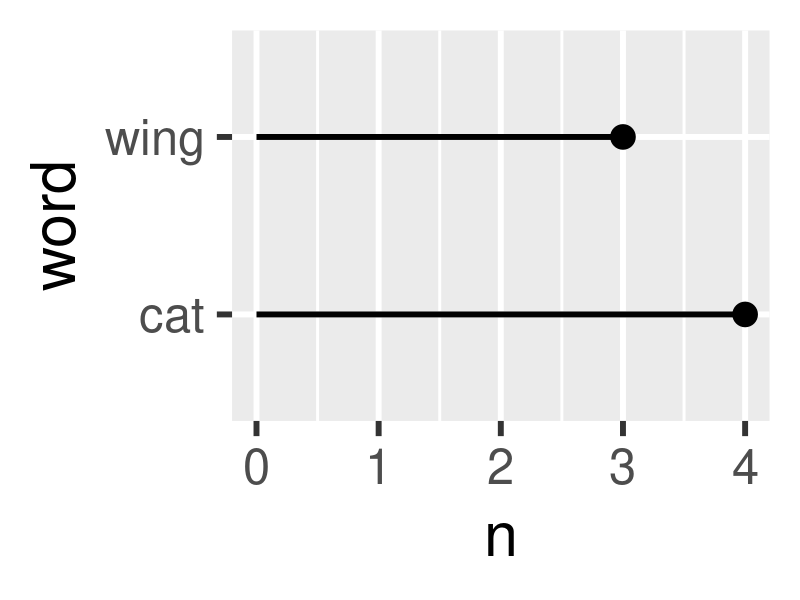

<!-- README.md is generated from README.Rmd. Please edit that file -->

# ggtextcounts

<!-- badges: start -->
<!-- badges: end -->

The goal of ggtextcounts is to make it easy to count word frequencies in
natural language in a data frame column.

## Installation

You can install the development version of ggtextcounts from with:

``` r
# install.packages("devtools")
devtools::install_github("alicirce/ggtextcounts")
```

## Example: Counting mentions in a data frame

This is a basic example which shows you how to solve a common problem:

``` r
library(ggtextcounts)
library(dplyr, warn.conflicts = FALSE)
example_data <- data.frame(
  chapter = c(1:3),
  text = c(
    "Once upon a time there was a cat. The cat's name was Jennifer.",
    "This cat was unlike other cats, in that she had wings.",
    "Each wing was feathered. She loved to spread her wings and fly."
  )
)
```

With word boundaries, “cats” isn’t counted in the second row:

``` r
count_mentions_in_dataframe(
  example_data,
  words = c("cat", "wing"),
  ignore_case = TRUE,
  word_boundaries = TRUE
)
#> # A tibble: 6 × 4
#>   chapter text                                                     menti…¹ word 
#>     <int> <chr>                                                      <dbl> <fct>
#> 1       1 Once upon a time there was a cat. The cat's name was Je…       2 cat  
#> 2       1 Once upon a time there was a cat. The cat's name was Je…       0 wing 
#> 3       2 This cat was unlike other cats, in that she had wings.         1 cat  
#> 4       2 This cat was unlike other cats, in that she had wings.         0 wing 
#> 5       3 Each wing was feathered. She loved to spread her wings …       0 cat  
#> 6       3 Each wing was feathered. She loved to spread her wings …       1 wing 
#> # … with abbreviated variable name ¹​mentions
```

Without word boundaries, “cat” is counted twice in the second row

``` r
cat_wing_counts <- count_mentions_in_dataframe(
  example_data,
  words = c("cat", "wing"),
  ignore_case = TRUE,
  word_boundaries = FALSE
)
cat_wing_counts
#> # A tibble: 6 × 4
#>   chapter text                                                     menti…¹ word 
#>     <int> <chr>                                                      <dbl> <fct>
#> 1       1 Once upon a time there was a cat. The cat's name was Je…       2 cat  
#> 2       1 Once upon a time there was a cat. The cat's name was Je…       0 wing 
#> 3       2 This cat was unlike other cats, in that she had wings.         2 cat  
#> 4       2 This cat was unlike other cats, in that she had wings.         1 wing 
#> 5       3 Each wing was feathered. She loved to spread her wings …       0 cat  
#> 6       3 Each wing was feathered. She loved to spread her wings …       2 wing 
#> # … with abbreviated variable name ¹​mentions
```

## Plotting counts

Lollipop plots are a visually attractive way of plotting counts.

``` r
library(ggplot2)
cat_wing_counts %>%
  group_by(word) %>%
  summarize(n = sum(mentions)) %>%
  ggplot() +
  aes(y = word, x = n) +
  geom_h_lollipop()
#> Registered S3 method overwritten by 'ggpackets':
#>   method from   
#>   +.gg   ggplot2
```


